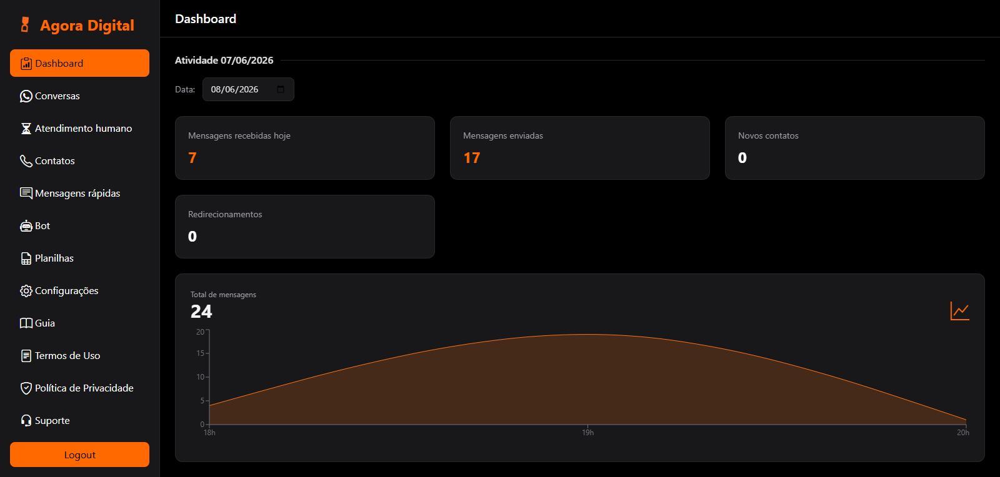
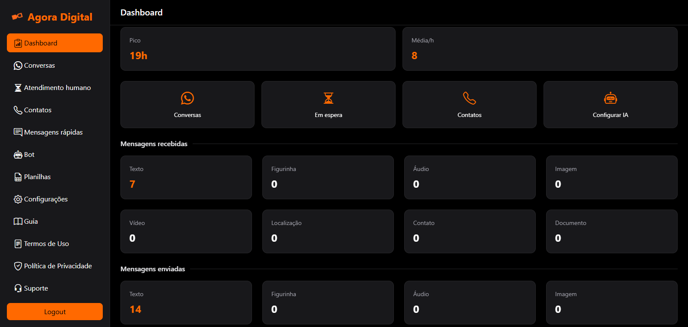
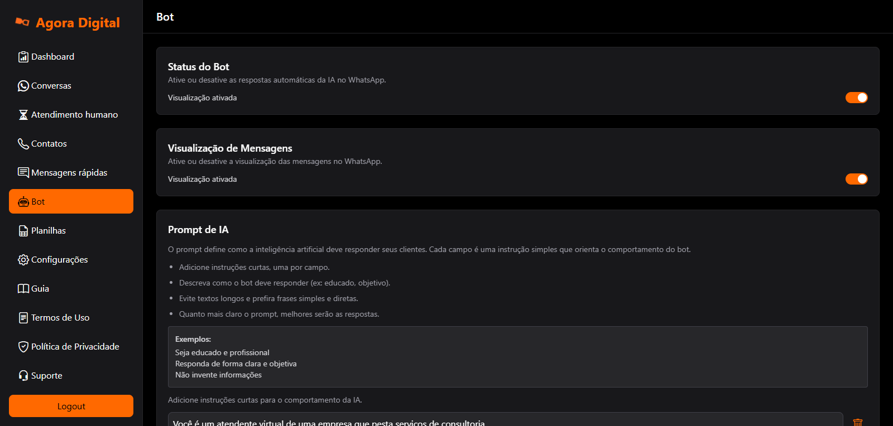
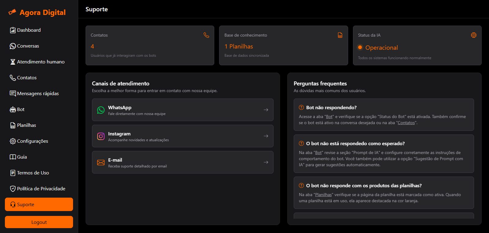

# 💬 Chat Web Application

Aplicação web de chat em tempo real construída com **React**, utilizando **React Router** para navegação, **cookies** para autenticação e **WebSockets** para comunicação em tempo real.

---






---

# 🚀 Tecnologias Utilizadas

* React
* React Router DOM
* Tailwind
* js-cookie
* axios
* WebSocket / socket.io-client

---

# 📦 Instalação

Clone o repositório:

```bash
git clone https://github.com/elguesabal/chat-WhatsApp.git
```

Entre na pasta do projeto:

```bash
cd chat-WhatsApp
```

Instale as dependências:

```bash
npm install
```

---

# ▶️ Executando o projeto

Para iniciar o servidor de desenvolvimento:

```bash
npm run dev
```

A aplicação estará disponível em:

```
http://localhost:5173
```

---

# 📁 Estrutura do Projeto

```
src
│
├── route
│   ├── home
│   │
│   ├── login
│   │
│   ├── chats
│   │
│   ├── chat
│   │
│   └── NotFound
│
├── socket
|
├── screens
│
├── style
│
└── main.jsx
```

---

# 🔀 Sistema de Rotas

A navegação da aplicação é controlada utilizando **React Router DOM**.

| Rota           | Página   | Descrição              |
| -------------- | -------- | ---------------------- |
| `/`            | Home     | Página inicial         |
| `/login`       | Login    | Página de autenticação |
| `/chat`        | Chats    | Lista de conversas     |
| `/chat/:phone` | Chat     | Conversa específica    |
| `*`            | NotFound | Página não encontrada  |

---

# 🔐 Autenticação

A autenticação do usuário é verificada através de **cookies armazenados no navegador**.

Cookies utilizados:

| Cookie    | Descrição                     |
| --------- | ----------------------------- |
| `phone`   | Número do telefone do usuário |
| `idPhone` | Identificador interno         |
| `token`   | Token de autenticação         |

Se qualquer um desses cookies **não existir**, o usuário será redirecionado automaticamente para `/login`.

---

# 🛡️ ProtectedRoute

O componente `ProtectedRoute` é responsável por proteger rotas privadas da aplicação.

```javascript
function ProtectedRoute({ children }) {
	const phone = Cookies.get("phone");
	const idPhone = Cookies.get("idPhone");
	const token = Cookies.get("token");

	if (!phone || !idPhone || !token) return (<Navigate to="/login" replace />);
	return (children);
}
```

Ele garante que apenas usuários autenticados possam acessar páginas protegidas.

---

# 🔌 WebSocket Events (Front-End)

A aplicação utiliza **WebSocket** para comunicação em tempo real entre o **Front-End** e o **Back-End**.

Exemplos de uso:

* Envio de mensagens instantâneas
* Atualização automática de chats
* Comunicação cliente-servidor em tempo real

---

# 🔐 Autenticação do WebSocket

Para que o cliente consiga utilizar os eventos do WebSocket, é necessário que o navegador possua o cookie **`token`** ativo.

Esse token é utilizado pelo servidor para **identificar e autenticar o usuário durante a conexão do socket**. A presença desse cookie garante que os eventos enviados pelo cliente estejam associados a um usuário válido.

Caso o cookie **`token`** não exista ou seja inválido, o servidor pode **recusar a conexão ou ignorar os eventos enviados pelo cliente**.

Portanto, antes de utilizar os eventos de WebSocket documentados neste projeto, é necessário garantir que o usuário esteja **autenticado e com o cookie `token` presente no navegador**.

---

# 📥 Eventos que o Front-End pode utilizar

## /dashboard

| Tipo   | Evento                      | Descrição                                              |
| ------ | --------------------------- | ------------------------------------------------------ |
| `emit` | `dashboard:info`            | Solicita métricas do usuário com base na data enviada. |

---

## /chat

| Tipo   | Evento                      | Descrição                                                                                  |
| ------ | --------------------------- | ------------------------------------------------------------------------------------------ |
| `emit` | `chats:load_chats`          | Carrega a lista de chats do usuário.                                                       |
| `emit` | `chats:update_human_viewed` | Informa o back-end que o chat foi aberto por um humano.                                    |
| `on`   | `chat:new_message`          | Atuliza a lista de conversas, aplica estilização de mensagem não lida e exibe notificação. |

---

## /chat/:phone

| Tipo   | Evento                      | Descrição                                                                          |
| ------ | --------------------------- | ---------------------------------------------------------------------------------- |
| `emit` | `chat:load_messages`        | Carrega as mensagens de um chat.                                                   |
| `emit` | `chats:update_human_viewed` | Notifica o bakc-end a abertura do chat por humano quando chega uma nova mensagem.  |
| `emit` | `chat:reply_window`         | Verifica se a janela de resposta do WhatsApp (24h) ainda está aberta.              |
| `emit` | `chat:quick_messages`       | Retorna mensagens rápidas pré-definidas.                                           |
| `emit` | `chat:send:text`            | Envia uma mensagem de texto.                                                       |
| `emit` | `chat:send:location`        | Envia uma mensagem de localização.                                                 |
| `emit` | `chat:bot:on_off`           | Consulta ou altera o estado do bot em um chat.                                     |
| `emit` | `chat:info_contact`         | Consulta os dados de um contato.                                                   |
| `emit` | `contacts:save_comment`     | Salva o comentário de um contato.                                                  |
| `on`   | `chat:new_message`          | Atuliza o chat quando uma nova mensagem é enviada ou recebida.                     |
| `on`   | `chat:update_view`          | Atualiza o status de visualização de uma mensagem.                                 |
| `on`   | `chat:new_react`            | Atualiza o chat quando uma mensagem recebe uma reação.                             |
---

## /contacts

| Tipo   | Evento                   | Descrição                                          |
| ------ | ------------------------ | -------------------------------------------------- |
| `emit` | `contacts:load_contacts` | Carrega os contatos para serem exibidos na página. |
| `emit` | `contacts:save_comment`  | Salva o comentário em um contato.                  |
---

## /spreadsheets

| Tipo   | Evento                                  | Descrição                                                                           |
| ------ | --------------------------------------- | ----------------------------------------------------------------------------------- |
| `emit` | `spreadsheets:get_spreadsheets`         | Carrega as páginas existentes e quais estão alimentando a IA.                       |
| `emit` | `spreadsheets:update_used_spreadsheets` | Informa ao servidor que uma página da planilha começou ou deixou de alimentar a IA. |
---

# 📡 Exemplo de uso no Front-End

```javascript
socket.emit("chat:send:text", data, (response) => {
	console.log(response);
});
```

Escutando eventos do servidor:

```javascript
socket.on("chat:new_message", (data) => {
	console.log(data);
});
```